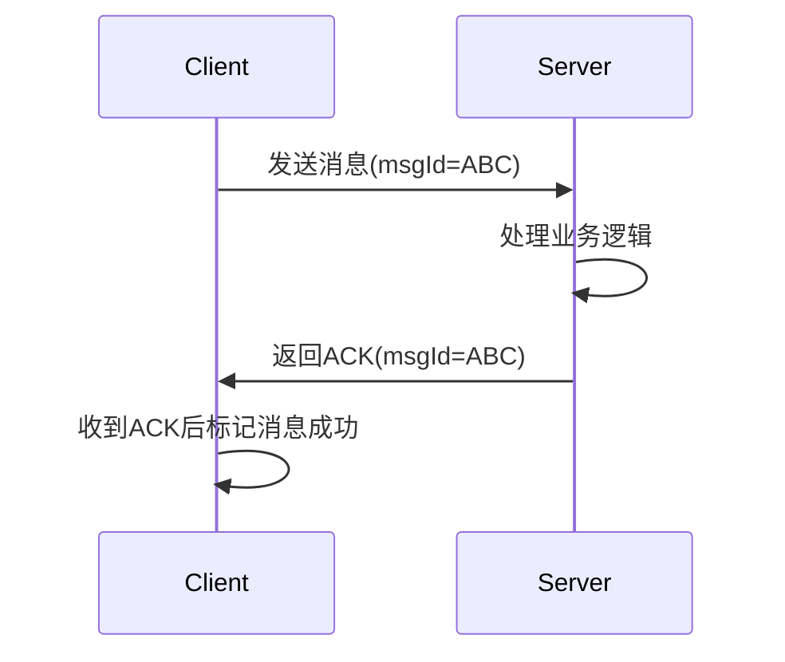

# 人工客服方案

<div style="background: #f8f9fa; padding: 12px 16px; border-left: 3px solid #4CAF50; margin-bottom: 16px; border-radius: 0 4px 4px 0; font-size: 0.9rem">
    <div style="display: flex; align-items: center; gap: 30px; flex-wrap: wrap;">
        <div style="display: flex; align-items: center; gap: 8px;">
            <span style="color: #666;">📅</span>
            <span>2025-07-02</span>
        </div>
        <div style="display: flex; align-items: center; gap: 8px;">
            <span style="color: #666;">✍️</span>
            <span>Jixer</span>
        </div>
    </div>
</div>

## 技术选型

### 方案

- **方案一：**沿用项目中已使用的聊天方案：基于 Java EE 的 WebSocket 标准（JSR-356）

  - 优点：

    1、成本低，快速上手

  - 缺点：
    1、通常做多只能支持几千个连接，当连接过多会出现资源耗尽、性能降低等问题

    2、心跳检测不完善，无法及时检测断开的连接

    3、没有对用户进行认证、消息确认、消息重试等机制

    4、发送消息是同步阻塞方式，高并发下性能低

- **方案二：**使用 Netty 框架

  - 优点：

    1、采用 NIO 方式，单机最高支持10万+个连接

    2、延迟低、内存占用小
  
- **方案三：**短轮询

  - 缺点：

    1、会产生大量无效请求
    
  - 适用场景：
  
    1、扫码登录
  
    2、客户端使用量不大的情况
  
- **方案四：**长轮询（请求会长时间挂在服务器端）
  
  - 缺点：
  
    1、后端服务器压力大
  
    2、任然存在无效请求

### WebSocket 连接过程

客户端会发送一个 http 请求，告诉服务器端要升级为 WebSocket 协议，等握手成功后就能够进行数据双向传输

首次请求如下所示：

```
accept-encoding		gzip, deflate, br, zstd
accept-language		zh-CN,zh;q=0.9,en;q=0.8,en-GB;q=0.7,en-US;q=0.6
cache-control 		no-cache
connection			Upgrade   // 升级协议
upgrade				websocket   // 升级协议
host				xxxx.xxxx.xxxx
origin				xxxx.xxxx.xxxx
pragma				no-cache
sec-websocket-extensions	permessage-deflate; client_max_window_bits
sec-websocket-key			O7JM2xKwy+5NInxu2Jmdew==
sec-websocket-version		13
```

### 两种 Websocket 实现对比

以下是 Tomcat 实现 WebSocket 与 Netty 在实现 WebSocket 服务时的对比表格：

| **对比维度**     | **原生WebSocket (JSR-356)**                                  | **Netty**                                                    |
| ---------------- | ------------------------------------------------------------ | ------------------------------------------------------------ |
| **协议支持**     | 仅支持标准WebSocket协议                                      | 支持WebSocket及自定义协议，可扩展其他协议(如MQTT)            |
| **性能**         | 单机约支持5,000-10,000连接                                   | 单机可支持100,000+连接                                       |
| **线程模型**     | 依赖Servlet容器线程模型(阻塞IO)，基于多线程的架构，每个连接都会分配一个线程，适用于处理相对较少的并发连接 | 基于Reactor的非阻塞IO模型(多路复用)，使用单线程或少量线程处理大量的并发连接 |
| **内存管理**     | 普通JVM内存管理                                              | 自带内存池和零拷贝技术                                       |
| **代码复杂度**   | 注解驱动，开发简单                                           | 需要理解Channel、Pipeline等概念，学习曲线较陡                |
| **依赖关系**     | 内置于Java EE/Jakarta EE容器                                 | 需额外引入Netty依赖                                          |
| **心跳机制**     | 需手动实现                                                   | 内置IdleStateHandler                                         |
| **SSL支持**      | 需容器配置                                                   | 通过SslHandler快速集成                                       |
| **集群支持**     | 需自行实现(如Redis广播)                                      | 可结合多种集群方案(如Zookeeper)                              |
| **广播效率**     | O(n)遍历发送                                                 | 优化的ChannelGroup批量写入                                   |
| **调试难度**     | 简单，日志直观                                               | 需理解事件循环机制，调试较复杂                               |
| **适用场景**     | 中小规模应用(≤1万连接)                                       | 高并发、低延迟、自定义协议场景                               |
| **典型QPS**      | 1万-5万                                                      | 10万-100万+                                                  |
| **连接建立速度** | 较慢(受限于容器线程池)                                       | 极快(基于NIO)                                                |
| **内存占用**     | 较高(每个连接独立Session对象)                                | 较低(共享ByteBuf内存池)                                      |
| **与Spring集成** | 无缝集成(@ServerEndpoint)                                    | 需手动配置，但Spring有Netty支持包                            |
| **长连接保活**   | 依赖容器实现                                                 | 可精细控制(如自定义心跳间隔)                                 |
| **错误恢复**     | 自动重连机制有限                                             | 可灵活定制重试策略                                           |
| **生产案例**     | 中小型聊天应用、通知服务                                     | 大型IM系统、游戏服务器、金融交易系统                         |

## 基础功能

### 用户

供应商平台，右下角点击客服，弹出一个小窗口，大致效果如下图所示

聊天顺序：

- 先是 AI 聊天，此时只能发送文本消息，AI 能够根据后台上传好的文档（Word、PDF 等）来进行回答。若用户的问题得不到解决，可以点击转人工
- 然后是人工聊天，此时可以发送文本消息、文件等


### 客服

在自建平台或者供应商平台新增一个页面，大致效果如下图所示

一般来说是由用户来主动连接，系统来给用户找一个在线的客服（轮训算法），该客服页面左侧就会新增一栏新的聊天记录

客服也能够对用户发送文本消息、文件等


## 拓展功能

- 消息撤回功能（2分钟内可撤回）
- 客服快捷回复模板
- 热点问题分析看板
- 客服工单、用户打分
- 等等

## 技术优化实现

### 混合传输模式

Websocket 采用二进制帧进行数据传输

- 对于文本内容，发送方先转为 JSON 格式，再进行传输；接收方将 JSON 格式转为 Java对象
- 对于文件，文件拆分成多个分片，分开传输（解决大文件传输过慢的问题）

### 心跳检测机制

作用：保证服务端和客服端的连接的稳定性

在正常情况下，用户可以主动的关闭浏览器来关闭与服务器端的连接。但在异常情况下，如果用户的浏览器突然崩溃、网络中断或者关闭页面时，前端无法发送断开请求，服务端也无法及时感知到客户端已经下线

有两种心跳机制，应用层 HEARTBEAT 消息或者 TCP 层 Ping/Pong）来实现 WebSocket 连接的健康检查

| 对比维度   | 协议层(Ping/Pong) | 应用层(HEARTBEAT) |
| ---------- | ----------------- | ----------------- |
| 兼容性     | 所有WebSocket实现 | 需客户端配合协议  |
| 网络开销   | 2字节（帧头）     | 消息体+解析成本   |
| 实现复杂度 | Netty自动处理     | 需手动编码        |
| 跨语言支持 | 通用              | 需各客户端适配    |

推荐使用 Ping/Pong 来实现心跳检测

### 重试机制

重试机制在客户端设置，服务端不主动进行重试

### 消息确认机制

流程时序图如下：



可参考的 JSON 格式：

```json
// 客户端发送消息
{
  "msgId": "123e4567-e89b-12d3-a456-426614174000", // UUID
  "type": "chat",
  "content": "Hello",
  "timestamp": 1620000000
}

// 服务端确认响应
{
  "msgId": "123e4567-e89b-12d3-a456-426614174000", // 原消息ID
  "type": "ack",
  "status": "success", // success/failure
  "timestamp": 1620000001
}
```

由 status 标志是否成功，若消息接收失败，则失败的场景以及处理策略如下：

| 失败场景           | 检测方式                        | 处理策略                                           |
| ------------------ | ------------------------------- | -------------------------------------------------- |
| **网络丢包**       | ACK超未收到                     | 客户端自动重发（指数退避）                         |
| **服务端处理失败** | 服务端返回`status=failure`的ACK | 客户端根据错误类型决定重发或转人工                 |
| **消息重复**       | 服务端发现重复`msgId`           | 返回成功ACK但不再处理业务                          |
| **持久化失败**     | 数据库异常日志                  | 异步重试队列 + 告警通知                            |
| **客户端崩溃**     | 心跳超时                        | 服务端清理会话状态，客户端重启后重新拉取未确认消息 |

### 自定义二进制协议

Websocket 协议与自定义二进制协议对比：

| 对比项         | WebSocket（JSON/Text）             | 自定义二进制协议                     |
| -------------- | ---------------------------------- | ------------------------------------ |
| **兼容性**     | ✅ 完美支持浏览器、移动端           | ❌ 需单独实现各平台客户端             |
| **开发复杂度** | ✅ 低（无需编解码，直接处理字符串） | ❌ 高（需设计协议、编解码、版本兼容） |
| **传输效率**   | ❌ 较低（文本协议，无压缩）         | ✅ 高（二进制紧凑，可压缩）           |
| **扩展性**     | ✅ 灵活（JSON可动态增减字段）       | ❌ 需提前设计字段（或使用Protobuf）   |
| **适用场景**   | 普通IM、网页聊天室                 | 游戏聊天、高频金融消息、IoT          |

优化：可使用 Protobuf 来进行代替 JSON 进行序列化和反序列化

考虑到人工客服发送的消息频率不是很高，所以暂不考虑自定义二进制协议

## 参考文章

- [https://blog.csdn.net/qq_27828675/article/details/122101564](https://blog.csdn.net/qq_27828675/article/details/122101564)