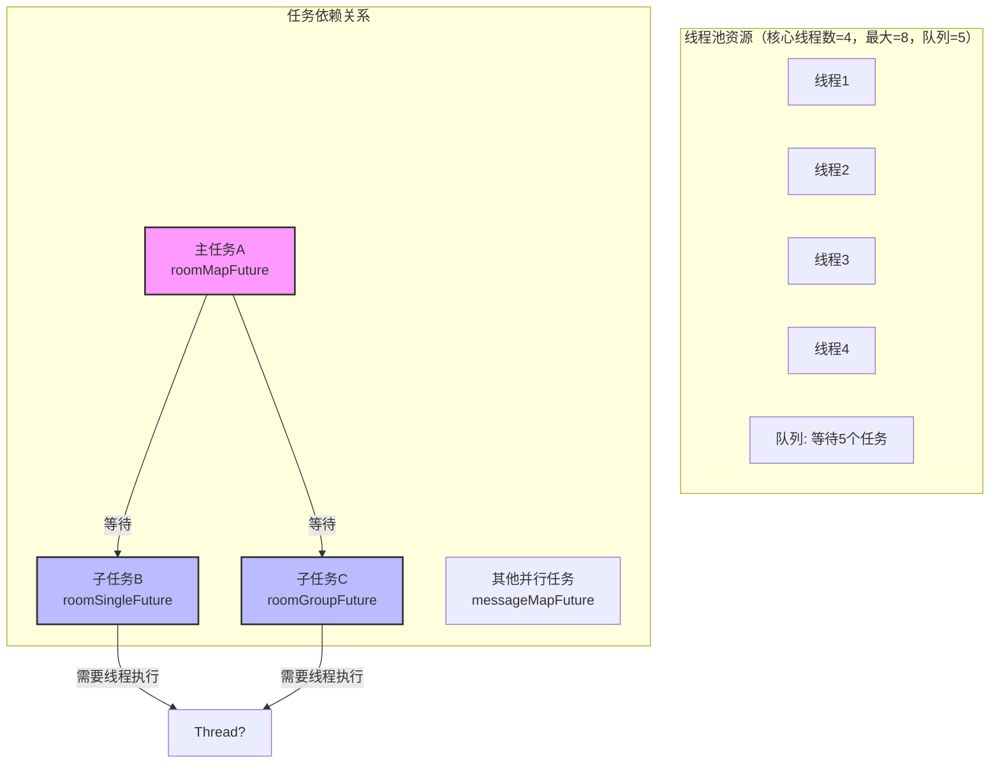

# 会话列表死锁问题解决方案

<div style="background: #f8f9fa; padding: 12px 16px; border-left: 3px solid #4CAF50; margin-bottom: 16px; border-radius: 0 4px 4px 0; font-size: 0.9rem">
    <div style="display: flex; align-items: center; gap: 30px; flex-wrap: wrap;">
        <div style="display: flex; align-items: center; gap: 8px;">
            <span style="color: #666;">📅</span>
            <span>2026-3-5</span>
        </div>
        <div style="display: flex; align-items: center; gap: 8px;">
            <span style="color: #666;">✍️</span>
            <span>Jixer</span>
        </div>
    </div>
</div>

## 问题背景

财务部门反馈即时通讯 PC 端出现一直转圈等待的情况，经过排查发现是查询会话列表这个接口超时了，其他接口能正常使用，后台日志页面无任何错误信息

## 问题分析

查询列表代码如下：

```java
@Override
public List<ImChatContactResp> selectImContactListWithUiParam(ImContact imContact, String userId) {
    // 获取查询参数，先暂存到ImContactDataHolder
    ImContactDataHolder imContactDataHolder = loadContactListData(imContact, userId);
    
    return pageList2CustomList(imContactDataHolder.getContactList(), (List<ImContact> list) -> {
        return list.stream().map(item -> {
    		// 组装会话信息
            // 代码省略
            return resp;
        }).collect(Collectors.toList());
    });
}
```

因为数据量过大，查询参数的时候用到了异步任务编排线程池加快查询

```java
private ImContactDataHolder loadContactListData(ImContact imContact, String userId) {
    ImContactDataHolder imContactDataHolder = new ImContactDataHolder();
    try {
       	// 获取会话信息
        List<ImContact> imContacts = selectImContactList(imContact);
        CompletableFuture<Void> roomMapFuture = CompletableFuture.supplyAsync(() -> {
            // 获取房间信息
            return imRoomCache.getBatch(roomIds);
        }).thenApplyAsync((roomMap) -> {           
            // 单聊缓存
            CompletableFuture<Void> roomSingleFuture = CompletableFuture.runAsync(() -> {
				// 代码省略
            }, threadPoolTaskExecutor);
            
            // 群聊缓存
            CompletableFuture<Void> roomGroupFuture = CompletableFuture.runAsync(() -> {
                // 代码省略
            }, threadPoolTaskExecutor);
            try {
                CompletableFuture.allOf(roomGroupFuture, roomSingleFuture).get();
            } catch (Exception e) {
            }
            return null;
        }, threadPoolTaskExecutor);
        
        // 消息缓存
        CompletableFuture<Void> messageMapFuture = CompletableFuture.runAsync(() -> {
           // 代码省略
        }, threadPoolTaskExecutor);
        
        // 公共聊天对象缓存
        CompletableFuture<Void> commonObjMapFuture = CompletableFuture.runAsync(() -> {
           // 代码省略
        }, threadPoolTaskExecutor);
        CompletableFuture.allOf(roomMapFuture, messageMapFuture, commonObjMapFuture).get();
    } catch (Exception e) {
    }
 
    return imContactDataHolder;
}
```

这里可以看到分别有

- 获取房间信息
  - 获取单聊
  - 获取群聊
- 获取消息信息
- 获取公共聊天对象信息

这一次就需要用到5个线程去执行

我的线程池配置如下：

```java
@Bean(ASYNC_TASK_EXECUTOR)
public ThreadPoolTaskExecutor asyncTaskExecutor() {
    AsyncTaskThreadExecutor executor = new AsyncTaskThreadExecutor();
    executor.setCorePoolSize(4);
    executor.setMaxPoolSize(8);
    executor.setQueueCapacity(1000);
    executor.setKeepAliveSeconds(300);
    executor.setThreadNamePrefix("async-task-executor-");
    executor.setRejectedExecutionHandler(new ThreadPoolExecutor.CallerRunsPolicy());
    executor.setThreadFactory(new WebsocketThreadFactory(executor));
    executor.initialize();
    return executor;
}
```

当请求并发量一多，这个线程池就会被占满。但继续分析就算是占满等几分钟肯定会能够使用，但是现象是一直卡住，等了很久还是这样。先增大核心线程数并重启临时解决了问题

第二天来了后继续排查，切换分支，对接口使用了 Jmeter 进行了压测，线程数用了10个，一启动就复原了问题，控制台无输出，但接口确实无法访问，断点调试到 `CompletableFuture.allOf(roomMapFuture, messageMapFuture, commonObjMapFuture).get();` 这一行的时候陷入了阻塞状态，无法获取结果

结合 AI，分析出原因是因为在异步任务编排的时候对线程池的使用用了**内部嵌套公用线程池，但线程不够**导致了死锁

```
┌─────────────────────────────────────────────────────────────────────────┐
│  假设线程池配置: core=4, max=8, queue=1000                               │
│  当前有10个请求同时进来                                                   │
└─────────────────────────────────────────────────────────────────────────┘

请求1 进入:
┌─────────────────────────────────────────────────────────────────────────┐
│ 线程1: [===== 执行 roomMapFuture (supplyAsync) =====]                 │
│        执行完毕后 -> 进入 thenApplyAsync()                              │
│        thenApplyAsync 内部调用 .get() 等待 roomSingleFuture           │
│        但 roomSingleFuture 在队列中等待分配线程...                      │
│                                                                         │
│ 线程2-4: 被其他请求的 roomMapFuture 占用                                │
│                                                                         │
│ 队列: [roomSingleFuture1, roomSingleFuture2, roomSingleFuture3...]    │
│       ↑ 22+ 个任务排队等待                                              │
└─────────────────────────────────────────────────────────────────────────┘
                              ↓
                        线程池已满！
                              ↓
请求1 的 .get() 永远等不到结果，因为没有空闲线程执行 roomSingleFuture
                              ↓
                        死锁！请求1一直阻塞
                              ↓
其他9个请求也都陆续进入类似状态
                              ↓
                        整个接口超时
```



主任务把线程池的核心线程占满了，子任务进了队列中。主任务需要等待子任务执行完才能执行，子任务需要新的线程执行，但此时无线程了，所以陷入了死锁

## 解决办法

1、调大线程池的参数、包括核心线程数、最大线程数、队列

2、新增另一个线程池专门用于处理子任务，避免出现公用线程池导致死锁